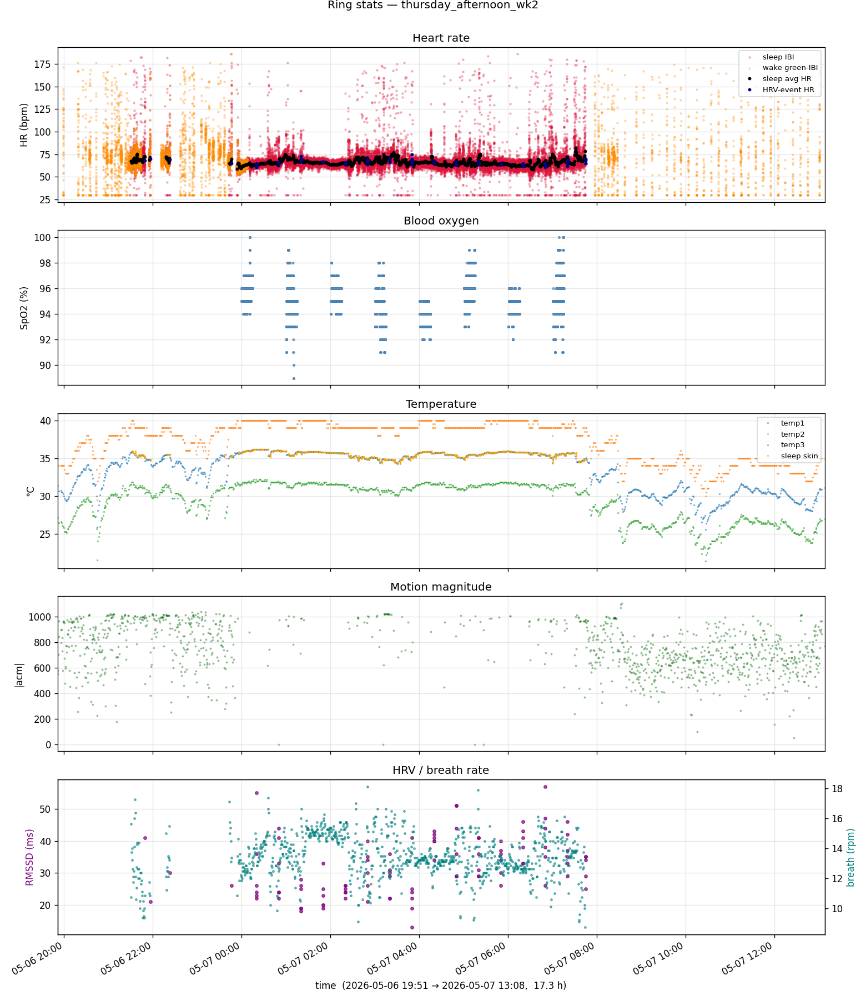

# open_ring

Pure-Python clean-room toolkit for talking to the Oura Ring 4 over BLE.

The repo contains a fully-mapped driver, a downstream analytics +
plotting package, host-side BLE pairing tooling, RE & verification
scripts, and a complete protocol specification — built up from static
RE of the official Android app's native shared objects and empirical
verification against ~953 K records of captured BLE traffic.

**Status:** protocol fully mapped. 100% structural decode coverage
across 40 unique captures (953,206 records). 0 decode errors.
**No vendored binaries. Stdlib + `bleak` + `cryptography`.**

### Live PPG, Heart Rate, Heart Rate Variability, SPO2, etc

**Raw Oura Ring data decoded live via BLE
---

## Repository layout

| Path | Contents |
|---|---|
| [`driver/`](driver/README.md) | The Python package implementing the BLE protocol — wire framing, decoders, async transport, persistence, state models. Importable as `driver`. |
| [`consumers/`](consumers/README.md) | Downstream analytics package — JSON-output summary modules (`hr`, `ble`, `battery`, `sleep`, `coverage`, `activity`, `temperature`) + matplotlib renderer (`plot`). Importable as `consumers`. |
| [`samples/`](samples/README.md) | Demo captures: JSONL driver output + rendered PNG plots used as input for `consumers.plot` and as a documentation corpus. |
| [`fixtures/`](fixtures/README.md) | Regression-test inputs the verify suite reads: btsnoop captures, on-device Realm JSON dumps, SQLite DB. Device-specific (your ring's data); not committed to the public repo. |
| [`tools/`](tools/README.md) | RE & verification scripts: `verify_claims.py` truth-table regression suite, static-analyzer for `libringeventparser.so`, host setup utilities, live HR scripts. |
| [`setup_scripts/`](setup_scripts/README.md) | Shell scripts for host BLE pairing (BlueZ privacy + IRK installation). |
| [`PROTOCOL.md`](PROTOCOL.md) | Self-contained protocol specification. Every opcode, every record type, the cryptographic handshake, the time-resolution algorithm. ~720 lines. |
| `assa-store.realm` | The Oura app's local DB. Source of the application-layer `auth_key`. Deployment-specific — your own copy goes here. |
| `junk/` | Scratch space: old captures, decompiled APK extracts, ad-hoc scripts. **Not maintained**, not part of the supported surface. |

---

## Quick start

### Replay an existing btsnoop capture

```sh
python3 -m driver.cli replay fixtures/sunday_evening.log | head
```

Produces JSONL on stdout — one record per line in the
[envelope schema](driver/README.md#jsonl-envelope) (PROTOCOL.md §9).

### Run summary statistics

```sh
# All modules, indented JSON
python3 -m consumers.cli fixtures/sunday_evening.log

# A single module on a JSONL
python3 -m consumers.cli samples/thursday_evening_wk2.jsonl --module hr
```

Both CLIs auto-detect input by extension (`.log` decodes via the driver,
`.jsonl` is read directly).

### Render a 5-panel biometric plot

```sh
pip install matplotlib
python3 -m consumers.plot samples/thursday_evening_wk2.jsonl
# → wrote samples/thursday_evening_wk2.png
```

### Verify everything

```sh
python3 tools/verify_claims.py | tail -3
# With all fixtures/ present:
# ## Verification — 235 claims tested
#    PASS=232  FAIL=3
# Without fixtures/ (static sources only): ~120 claims run.
```

The 3 expected FAILs are documented falsifications kept for traceability —
see [`tools/README.md`](tools/README.md#what-verify_claimspy-covers).

---

## Live BLE — first-time setup

Connecting to the ring from a fresh Linux host requires three pieces of
state ([PROTOCOL.md §1.3](PROTOCOL.md#13-authentication--pairing)).
The setup is:

```sh
# 1. Pull bt_config.conf from a rooted Android device that's already paired
adb shell "su -c 'cat /data/misc/bluetooth/bt_config.conf'" > bt_config.conf

# 2. Import the link-layer bond into BlueZ
sudo python3 tools/import_android_bond.py bt_config.conf

# 3. Edit setup_scripts/setup_ring.sh — paste your phone's LE_LOCAL_KEY_IRK
# 4. Apply the IRK to your host adapter (re-run after every bluetoothd restart)
sudo ./setup_scripts/setup_ring.sh

# 5. Connect
python3 -m driver.cli live --realm assa-store.realm --mac A0:38:F8:A4:09:C9 \
    > live_session.jsonl
```

Full detail: [`setup_scripts/README.md`](setup_scripts/README.md).

---

## Architecture

```
                       Oura Ring 4 (BLE peripheral)
                                ▲ ▼
                          BLE GATT (handles 0x12 / 0x15)
                                ▲ ▼
       ┌──────────────────── driver/ ────────────────────┐
       │  framing.parse_outer_frames / parse_inner_records│  ← TLV walker
       │  decoders.decode(type_byte, payload)             │  ← per-type wire decoders
       │  envelope.Record                                 │  ← typed dataclass
       │       ├─ t / rt / ctr / sess / tag / type        │
       │       ├─ data: type-specific decoded fields      │
       │       └─ t_event_ms: ring-emit time (PROTOCOL §7)│
       │  state.RingState / ClientState                   │  ← state-tracking models
       │  persistence.SyncState  (v4 schema, on disk)     │  ← cursor + time anchor
       │  transport.OuraRingClient                        │  ← async live BLE
       │  replay.replay(btsnoop_path)                     │  ← offline iterator
       └──────────────────────────────────────────────────┘
                                ▲ ▼ Record stream
       ┌────────────────── consumers/ ───────────────────┐
       │  hr / ble / battery / sleep / coverage /         │  ← JSON-output stats
       │  activity / temperature  (compute(records) → dict)│   (stdlib only)
       │  plot.render(records, …) → matplotlib.Figure     │  ← optional renderer
       │  open_records(path)                              │  ← .log + .jsonl loader
       └──────────────────────────────────────────────────┘
                                ▲ ▼
                         JSON / PNG / your code
```

The driver is the only component that touches wire bytes. `consumers`
operates exclusively on `Record` objects, so the analytics can be
re-used against any source — live BLE, offline btsnoop replay, or
already-decoded JSONL.

---

## Two planes

The driver surfaces **control-plane** and **data-plane** events
separately:

- **Data plane** — every `(re)connect` runs a history-fetch to retrieve
  records the ring buffered while disconnected. See PROTOCOL.md §6.4.
- **Control plane** — high-level methods like `set_spo2(on)`,
  `set_dhr_mode(3, 2)`, `request_hr_on_demand()` issue parameter writes
  and surface the responses. See [`driver/README.md`](driver/README.md#two-planes--control--data).

---

## Time semantics — `t` vs `t_event_ms`

Every Record carries two timestamps:

- **`t`** — when the driver received the BLE notification (UTC ms).
- **`t_event_ms`** — when the ring actually generated the event,
  interpolated from the most recent `API_TIME_SYNC_IND` anchor via the
  `RingTimeResolver` algorithm (reverse-engineered from
  `libappecore.so`; see PROTOCOL.md §7).

For live records the two differ by ≤300 ms (BLE pipeline latency). For
catchup records they can differ by hours or days — the ring buffered
events while disconnected, then dumped them in a single burst.

Use `t_event_ms` for analytics; `t` for transport-level analysis.
`consumers.event_time(r)` returns the best-available choice with
fallback.

---

## What's mapped

- 24/24 outer-frame opcodes
- 50/50 observed inner record types (3 of which were unnamed in the
  official app's enum, structurally decoded here)
- The handshake: `proof = AES_128_ECB(auth_key, nonce ‖ 0x01)[:16]`,
  verified against 484/484 captured nonce/proof pairs
- The time-resolution algorithm: 100 ms/tick (default) or 1 ms/tick
  (burst), verified against three independent anchor pairs (99.87,
  99.87, 100.27 ms/tick observed)
- Connection-time byte sequences for the four observed phone patterns
  (full setup / long catchup / quick refresh / ad-hoc HR)

Every claim in the regression suite passes against on-device DB
ground-truth: IBI mean within 1.3 ms, temperature ranges byte-for-byte
identical, motion ACM ranges byte-for-byte identical, raw 24-bit PPG
samples 100% sample-for-sample matched.

---

## Dependencies

| Package | Required for |
|---|---|
| Python 3.10+ | everything (uses `dict[K,V]` and `X \| Y` annotations) |
| `cryptography` (or `openssl` CLI as fallback) | the AES-128 handshake proof in `driver` |
| `bleak` | live BLE only — `driver.transport`, `tools/live_hr.py`, `tools/request_hr.py` |
| `matplotlib` | `consumers.plot` only (lazy import; rest of `consumers` is stdlib) |
| `llvm-objdump` (LLVM 14+) | `tools/extract_wireformat.py` and one section of the verify suite |

---

## Read more

- **[`PROTOCOL.md`](PROTOCOL.md)** — full wire-protocol specification (~720 lines).
  Self-contained reference; everything needed to reconstruct the protocol from scratch.
- **[`driver/README.md`](driver/README.md)** — driver's public API and usage.
- **[`consumers/README.md`](consumers/README.md)** — analytics module reference.
- **[`tools/README.md`](tools/README.md)** — verification and RE scripts.
- **[`setup_scripts/README.md`](setup_scripts/README.md)** — host BLE pairing.
- **[`samples/README.md`](samples/README.md)** — demo-capture corpus.
- **[`fixtures/README.md`](fixtures/README.md)** — regression-test fixtures.
## License Information
This project is licensed under the GNU General Public License version 3. See the LICENSE file for details.
